# Optical World Engine

*Mundus ipse systema opticum est* — the world itself is the optical system.

A physically grounded, spectral, non-sequential light-transport engine in which lenses,
telescopes, prisms, droplets and cameras are simply matter placed in a world. Images are not
assembled from effects: the engine defines matter and geometry, propagates light, and lets
images emerge.

The engine (C++20) has one world model and one **reference transport** in IEEE-754 double, and
runs that transport on interchangeable **backends**: `cpu`, the reference itself on host threads,
and `gpu`, a portable Vulkan compute port with kernels in Slang (NVIDIA, AMD, Intel, and Apple
silicon through MoltenVK) validated statistically against it. Which backend renders is a single
setting (`--backend cpu|gpu`); the scene, the measurement and every tool stay the same. It is
complete enough to render the canonical demonstrations, to analyse lenses, and to interrogate
every pixel.

| | |
|---|---|
| 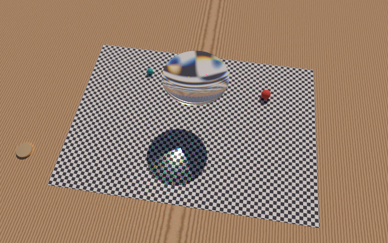 | 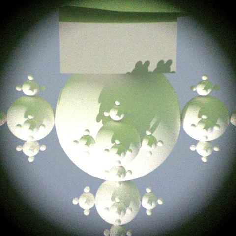 |
| **The Lens** — a loose magnifier over a page: magnified view, dispersion-tinted caustic in its shadow. | **The Telescope** — the eye's pupil placed at the telescope's computed exit pupil: the statue on the ridge, magnified 16× and inverted. |
| 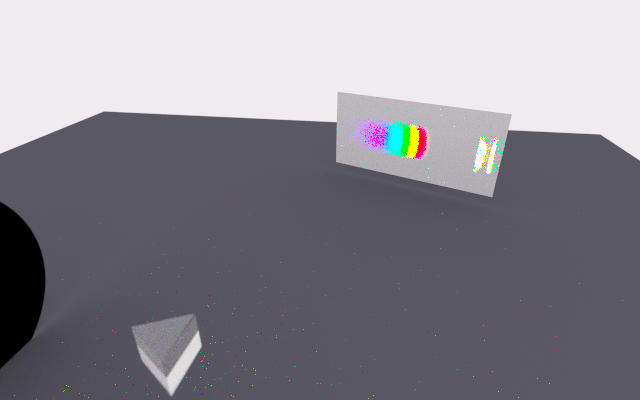 | 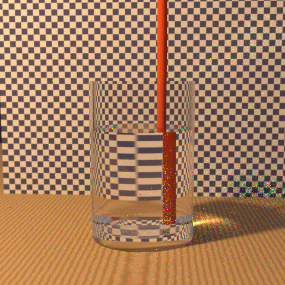 |
| **The Prism** — lamp → slit → collimator → N-SF11 prism → screen, plus a secondary spectrum from an internal reflection. | **The Glass of Water** — a rod broken at the water line; the card behind compressed by the water cylinder. |

| | |
|---|---|
| 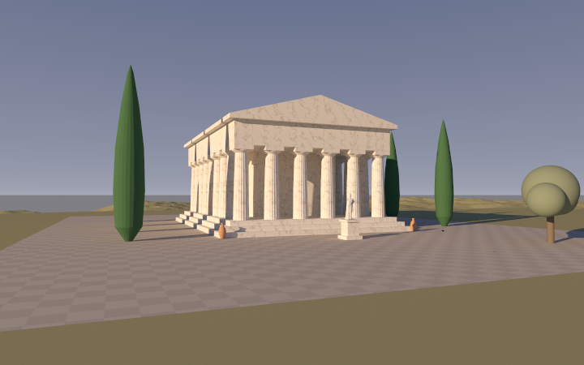 | 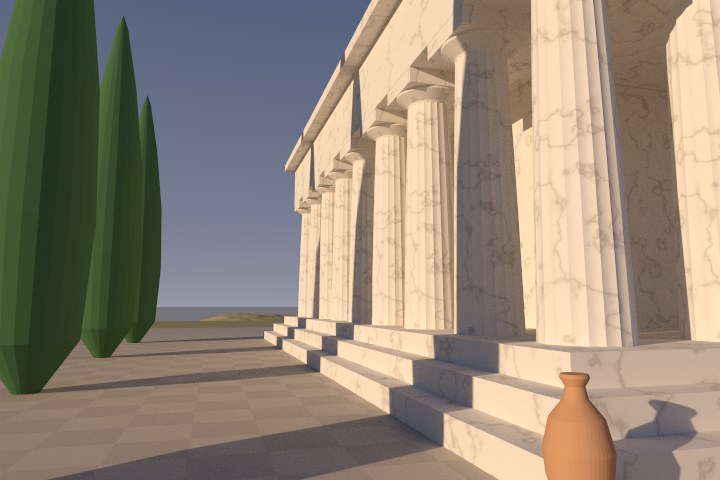 |
| **The Temple** — a Doric peristyle temple at golden hour, with a museum scan of Athena on her pedestal. | Fluted columns with entasis along the sunlit west colonnade. |
| 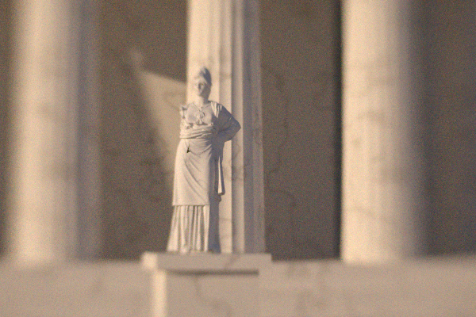 | 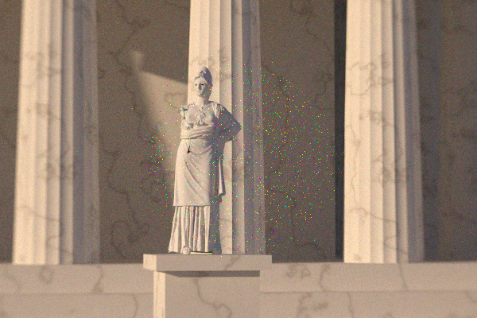 |
| **A physical camera**: 85 mm Petzval-type portrait lens at f/2, focused on Athena (DOF 10.9–13.2 m). | The same camera at f/11 focused at 25 m: the stop is smaller and the depth of field reaches the temple. |
| 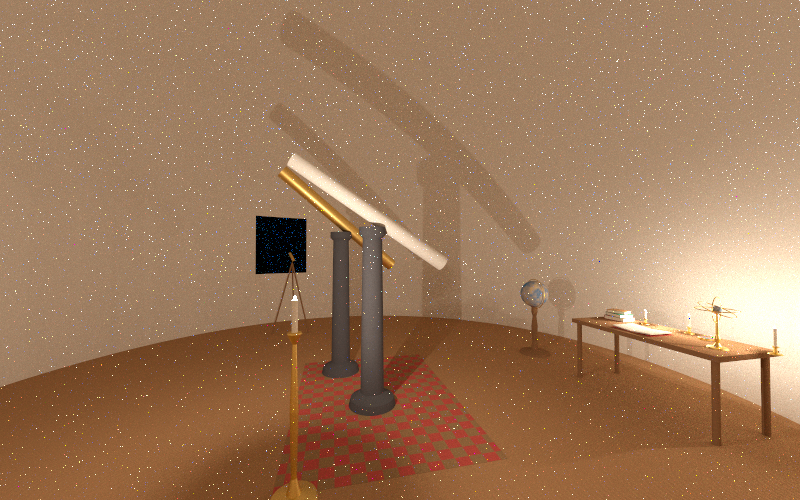 | 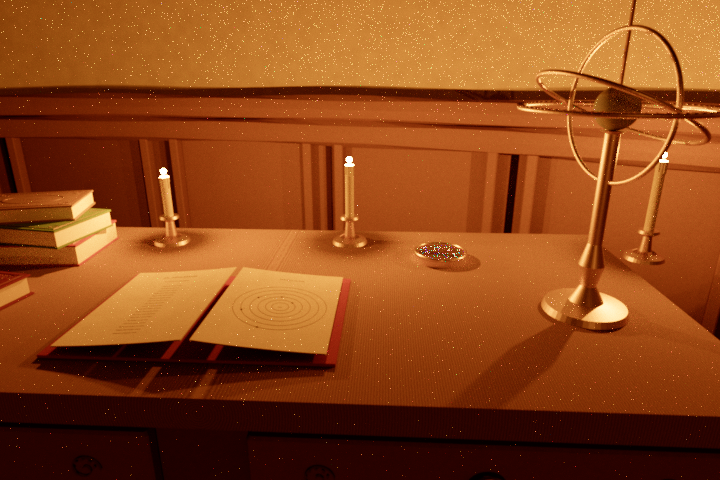 |
| **The Observatory** — a domed observatory at night, lit by candles; two refractors aim through the slit. | The astronomer's desk: books, an armillary, a compass under glass. |
| 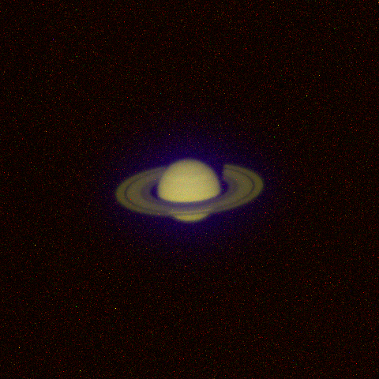 | 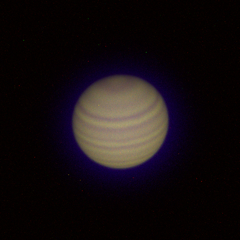 |
| **Saturn at 126×** through the 150 mm f/15 achromat: the planet and its rings are bodies at 1.28·10¹² m; the Cassini division and the globe's shadow on the rings follow from geometry, the violet halo from the achromat's secondary spectrum. | **Jupiter** through the second refractor. |
| 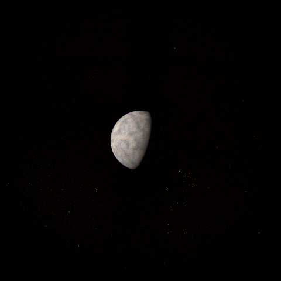 | 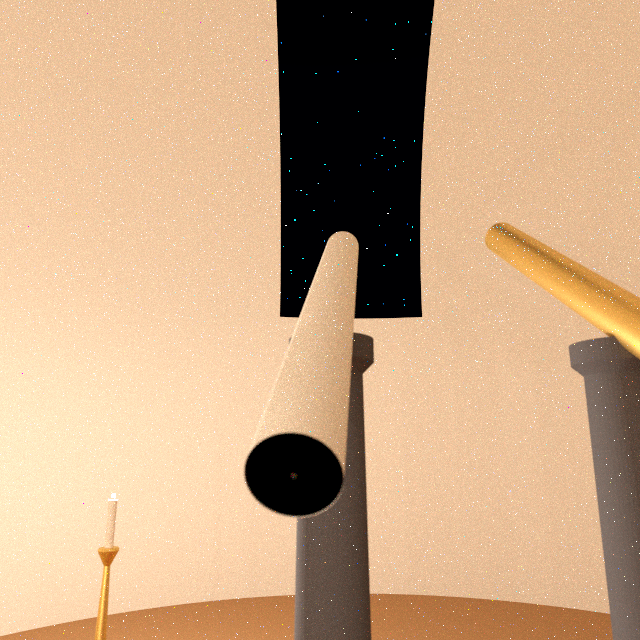 |
| **The Moon at 16×** through the small telescope at the window; its phase follows from where the sun is below the horizon. | The dome slit with the night sky, seen by the naked eye. |

More in [`docs/gallery`](docs/gallery) (each PNG has a JSON record for reproduction).

The scene models have since been refined with jointed paving, branching foliage, slope-grounded
landscapes, and a brick-and-stone observatory with a detailed study interior. The gallery above
records the earlier model set. See [`models/README.md`](models/README.md) for the current assets,
regeneration commands and the live Blender review (`bash tools/review_models.sh`). The models are
ordinary meshes: they change no transport, and every backend renders them.

## The one idea

There is one world model and one transport engine:

```
Medium  →  Region  →  Boundary  →  Body  →  Assembly
```

* A **medium** is constitutive data: n(λ) (Sellmeier, Cauchy, tabulated, Ciddor air; catalog
  glasses relative to air), absorption σₐ(λ), scattering σₛ(λ), phase anisotropy.
* A **region** is a connected domain filled with one medium.
* A **boundary** is an oriented surface separating the region on its front from the region
  on its back, with surface optics (Fresnel dielectric, rough GGX dielectric, Lambertian,
  conductor with complex n + ik, mirror, absorber, detector, null).
* A **body** is a physical object built from regions and boundaries — a lens is a volume of
  glass bounded by its polished surfaces, edge steps and rim; a cemented doublet is two
  regions sharing a boundary.
* An **assembly** positions bodies mechanically (a telescope, a camera).

The order in which light meets surfaces is never prescribed; it is discovered by ray casting.
Ghost paths such as S₄ → S₇ → S₄ → S₂ are simply paths. The same reference `Tracer` serves path
tracing, light tracing, the lens analyser and the inspector.

Where that transport runs is a separate, explicit choice — a **backend**:

```
                    world model (src/owe/scene)  ──  reference transport (src/owe/transport)
                                   │
          Renderer / Backend interface (src/owe/render) ── registry (src/owe/backends)
                 ┌─────────────────┴──────────────────┐
     backends/cpu: the reference on host     backends/gpu: float32 port on Vulkan
     threads, IEEE-754 double                compute (Slang kernels), camera-relative
```

The two backends are independent of each other (neither includes the other; the GPU backend
never includes the reference transport — a `layering` test enforces it) and meet only in the
interface. Every backend runs one conformance suite, and the GPU is tested against the reference
statistically. Details: [`docs/ARCHITECTURE.md`](docs/ARCHITECTURE.md#backends).

## Build and test

```sh
cmake -S . -B build -G Ninja -DCMAKE_BUILD_TYPE=Release
cmake --build build
(cd build && ctest --output-on-failure)     # or: build/owe_tests [filter]
```

Requirements: a C++20 compiler and CMake ≥ 3.20. zlib is optional (compressed PNGs).

With the GPU backend:

```sh
cmake -S . -B build -G Ninja -DCMAKE_BUILD_TYPE=Release -DOWE_GPU=ON
cmake --build build
build/owe backends                             # the backends in this build, their devices
```

`-DOWE_GPU=ON` fetches pinned Vulkan-Headers and volk, and uses `slangc` from the Vulkan SDK or
`PATH` (else downloads a pinned Slang release; `-DOWE_SLANGC=/path/to/slangc` overrides). At run
time only a Vulkan driver is needed: any recent NVIDIA, AMD or Intel driver on Linux/Windows; on
macOS, MoltenVK (`brew install molten-vk vulkan-loader`, or the LunarG Vulkan SDK). Without a
driver the conformance suite skips the GPU backend and `--backend gpu` explains why.

## Interactive viewer

Install the SDL3 development package (SDL ≥ 3.2), then enable the window:

```sh
cmake -S . -B build -G Ninja -DCMAKE_BUILD_TYPE=Release -DOWE_GPU=ON -DOWE_VIEWER=ON
cmake --build build
build/owe view                         # browse all scenes in scenes/
build/owe view --tour                  # automatically cycle through every detector
build/owe view --view the_temple.owe:Cam
```

CMake fetches Dear ImGui at a pinned release. `OWE_VIEWER` also works with `OWE_GPU=OFF`;
the viewer uses the GPU when available and otherwise uses the CPU. Run from the repository
root, or pass scene files/directories explicitly. For a lighter preview use `--scale 0.5`.

Select a detector in the scene browser, or use **Left/Right** to change scenes and **Up/Down**
to change views. The image refines progressively. **Space** pauses, **R** restarts, **G** switches
to the next backend (the Render panel has a button per backend), **T** toggles the tour, **F**
toggles fullscreen, **H** hides the panel, and **Q** quits.
The panel controls exposure, white balance, resolution, camera aperture/focus and scene edits.
Click a pixel to inspect its light paths. **S** saves PNG, raw PFM and a JSON render record under
`out/view_<scene>_<detector>`. On a backend without the scene's light or hybrid integrator the
view uses path tracing (same expected image); on the reference it can use either. Scene changes
take effect after the current render pass finishes.

### Explore the scene

Navigate over the image with these controls:

| Input | Action |
|---|---|
| Middle-mouse drag | Orbit around the point in front of the eye |
| Shift + middle-mouse drag | Pan sideways/up and down |
| Wheel, or Ctrl + middle-mouse drag | Move toward/away from the orbit point |
| Shift + click a surface | Set the orbit center and eye focus to that surface |
| Hold right mouse | Look around; WASD moves forward/back/sideways, Q/E moves down/up |
| Shift + F | Toggle fly mode without holding a mouse button; Escape releases the cursor |
| Shift / Ctrl while moving | Faster / precision movement |
| Wheel while flying | Adjust movement speed |
| Z/C while flying | Roll the view |
| Numpad 1/3/7 | Front/right/top perspective view; Ctrl selects the opposite side |
| Home | Return to the selected scene's saved view |

The **Explore** panel provides movement speed (metres/second), eye pupil diameter, focus,
field of view and exact position. **Walk at constant height** makes WASD horizontal; Q/E still
changes height. Navigation has no gravity or collision constraint, so it can pass through matter.
Hold **Ctrl** for precise alignment: translation, mouse look, roll, pan and dolly use the
adjustable **Ctrl speed / look** factor (20% by default). **Slow near surfaces** reduces
flight speed as you approach the surface ahead; at close range the default Ctrl speed is
4 mm/s, unless you explicitly select a slower base speed. Both settings are adjustable.
Ctrl takes priority over Shift when both are held.
Near a telescope, the panel reports your axial and lateral displacement from its exit pupil
in millimetres, plus the viewing angle relative to its axis. The glass surface and exit pupil
are different locations; these measurements do not move the eye or alter the rendered light.

You can move behind a loose lens or approach a telescope and look through it. For precise
alignment with a telescope's small exit pupil, select its **Eyepiece** view first and then explore
from there. Speed starts from the distance to the nearest surface and can be reduced for
millimetre-scale adjustments. Optical paths still pass through the actual scene geometry.
The **Look through …** bookmarks place the eye at a telescope's computed exit pupil and adopt
its focus, pupil, field of view and exposure. While walking within 25 cm of an eyepiece,
press **Enter** to do the same for the nearest telescope. These are ordinary observer poses
traced through the instrument, not pre-rendered images.

Movement uses a temporary virtual eye; physical cameras, sensors, lenses and saved observer
positions stay in place. Moving renders a preview up to 320 pixels wide; after a short pause,
the selected resolution returns and the image refines. GPU camera changes retain mesh buffers
and the compute pipeline. Exploration uses path tracing on every backend. Saved exploration
images have an `_explore` suffix, and their JSON records include the eye's exact pose and optics.

Images form through light transport at arbitrary eye positions; selecting a saved view does
not activate an optical instrument. An eye that intercepts the telescope's emerging light
bundle sees its image, with pupil clipping, defocus and vignetting determined by the geometry.
A large field of view also makes the planetary disc occupy fewer pixels.
The telescope scenes include physical black eyecups to reduce room light reflecting off the
glass. The lenses remain uncoated and the observer remains a virtual pupil without a head;
Fresnel reflections of the surroundings are still possible. These are separate paths from
the transmitted celestial image, not a replacement for that image.

The main `camera_obscura.owe` is a pinhole camera: a 6 mm opening with no glass. It has no
lens focal plane, but a finite opening still blurs the image. For an object distance `s`,
screen distance `L` and hole diameter `d`, the geometric blur diameter is `d * (1 + L/s)`.
Larger holes admit more light and produce more blur. Diffraction is not simulated; this
geometrical model cannot predict the optimum pinhole diameter or wave-limited resolution.
`camera_obscura_lens.owe` preserves the original 300 mm diameter, 3 m focal-length lens
camera, whose image does depend on lens focus.

The camera obscura and optical bench use diffuse measurement screens. Incident light
is reflected throughout the illuminated front hemisphere, so the projection remains
visible as the observer walks around that side. The screen is opaque: the front projection
does not appear through its back. `camera_obscura.owe:Inside` and
`optical_bench.owe:ScreenView` are convenient starting positions for exploring this.
The `BackWall` and `Sensor` entries instead show an irradiance readout of the screen itself;
they are not observer viewpoints. Move around on the illuminated side to inspect the image.
The obscura starts with automatic exposure, which re-meters the current image as you walk
outside. Auto exposure protects the 99th luminance percentile and compact central highlights
supported by neighbouring pixels. A centred planet occupying less than 1% of a wide view therefore
still limits the gain, instead of a weak surrounding glass reflection being raised to grey.
The panel reports the automatic gain in EV; turning
auto exposure off locks the current brightness for comparisons between views. Turning it
on restores automatic metering with zero exposure compensation. Display processing does
not change the raw radiance. In particular, automatic metering can make a weak glass
reflection look bright when it occupies most of the view. The glass model is uncoated;
it does not model the anti-reflection coatings found on many real telescope lenses.

The observatory uses a common relative photometric scale for sunlight, candles and synthetic
stars: the small flames represent about 1 cd, the larger flame 2 cd, relative to 100,000 lux
normal sunlight. The synthetic stars have enlarged angular discs with correspondingly
reduced radiance. They are sampled directly in a separate group from nearby lamps; a diffuse
sampling guide toward the Moon resolves reflected moonlight on the landscape. Both are
importance-sampling choices and preserve the same physical light paths. The scene uses
neutral display white so a candlelight correction does not turn outdoor illumination blue.

For an automatic window capture, use `--screenshot preview.png --after 5`. With `--tour` and
a directory ending in `/`, it captures each detector once and exits. The viewer smoke test
runs a two-scene tour using SDL's software renderer without requiring a desktop.

## Quick start

```sh
build/owe render scenes/the_lens.owe --spp 128 --out lens          # lens.png, lens.pfm, lens.json
build/owe render scenes/the_telescope.owe --detector Eyepiece --spp 256 --passes 8 --out scope
build/owe probe  scenes/the_lens.owe --pixel 320 110 --svg why.svg  # why is this pixel this colour?
build/owe emit   scenes/the_prism.owe --from -0.3195,0,0.1 --dir 1,0,0 --cone 0.25 --svg beam.svg
build/owe lens   lenses/kepler_16x.lens --afocal --fields 0,0.3,0.6
build/owe glass  N-SF11
build/owe info   scenes/the_telescope.owe                           # the world's ontology
build/owe render scenes/the_temple.owe --detector Cam --set Cam.f_number=5.6 --set "Cam.focus=20 m"
build/owe studio scenes/the_temple.owe --detector Cam                # interactive: set, render, probe
build/owe render scenes/the_temple.owe --detector Cam --backend gpu --spp 1024 --out cam   # same render, on the GPU
build/owe compare scenes/the_temple.owe:Cam --backend gpu            # GPU vs the reference, statistically
build/owe bench --backend gpu                                        # throughput on the canonical suite
build/owe backends                                                   # what this build can run on
```

### Cameras: aperture and focus

A `camera` is a physical camera: lens bodies from a prescription, a housing, mounts, an
aperture stop and a sensor surface. `f_number` resizes the physical stop, and `focus` moves
the sensor to the real plane of best focus for that object distance. Both are ordinary scene
values, so they can be changed from the command line with `--set` (any `Block.key=value`) or
live in the studio:

```
$ build/owe studio scenes/the_temple.owe --detector Cam --resolution 300x200
camera 'Cam' ...
EFL 86.3 mm, f/2.00, focus 11.950 m; depth of field 10.945 m to 13.158 m (CoC 29 µm)
> render 16 4                       # 4 passes of 16 spp; studio.png/.pfm/.json after each
> set Cam.f_number=11               # the stop closes; the scene is rebuilt and refined afresh
> set Cam.focus=25 m
> render 32 4
> probe 150 100                     # why is this pixel this colour?
> detector Wide                     # any observer, camera or sensor
```

Commands: `set`, `unset`, `edits`, `detector`, `size WxH`, `backend NAME`, `render [SPP] [PASSES]`,
`reset`, `exposure EV|auto`, `info`, `probe X Y [N]`, `quit`. `backend gpu` moves the same session
to the GPU (and `backend cpu` back). The same commands can be piped from a file for scripted sweeps.

### `render` — progressive spectral rendering

Writes `PREFIX.png` (display), `PREFIX.pfm` (raw linear, never touched by display
processing) and `PREFIX.json` (reproducibility record: scene hash, integrator, sampling
strategy, seed, samples, render time, statistics) after every pass, so image quality grows
with observation time. Integrators:

* `path` — unidirectional spectral path tracing with next-event estimation and MIS.
* `light` — particle tracing: emitters (area lights, sun, sky) → world → sensors, with
  connections to virtual eyes.
* `hybrid` — a disjoint partition of path space: light tracing owns *eye → diffuse →
  specular⁺ → light* paths (caustics seen directly), path tracing everything else. Both
  are unbiased on their partitions, so the sum is unbiased.

On the reference backend, renders are bit-for-bit reproducible for a given seed, independent of
thread count and of the compiler; on the GPU, for a given device and driver.

### Backends: where the transport runs

`--backend NAME` on `render`, `studio`, `bench`, `view` and `compare` chooses the backend; nothing
else changes — the scene, the detector, the output files and the record (which names the backend).
`owe backends` lists the backends in the build, whether each can run here (and why not), their
devices and integrators:

| | `cpu` (reference, default) | `gpu` |
|---|---|---|
| Where | host threads | Vulkan compute: NVIDIA, AMD, Intel; Apple silicon via MoltenVK |
| Arithmetic | IEEE-754 double | float32, camera-relative |
| Integrators | path, light, hybrid | path, light, hybrid |
| Reproducible | bitwise for a seed, any thread count or compiler | bitwise on a given device and driver |

`--backend gpu` runs every integrator as Slang kernels on Vulkan compute. It is a float port of the reference: the same shapes and quadric root
refinement, the same two-level hierarchy, spectra, glass catalogue, textures, Fresnel and GGX
scattering, hero wavelengths, next-event estimation with MIS — and the same PCG32 random streams
drawn in the same order, so a GPU image carries the CPU image's noise pattern until float
rounding makes a path decide differently. Precision is kept by working camera-relative (the
world is differenced with the detector's origin in double before rounding), re-solving quadric
hits near the hit point, and scaling ray offsets with each frame's float error; Saturn at
1.28·10¹² m through the observatory's refractor agrees with the double reference.

Where the device has ray-tracing hardware (NVIDIA RTX, AMD RDNA2+, Intel Arc: `VK_KHR_ray_query`;
`owe backends` says "ray queries"), the kernels traverse with it: every mesh group is a triangle
acceleration structure and every analytic boundary a box whose candidates the kernel's own
intersection code resolves, so the float precision measures stay the same. Elsewhere — Apple
silicon through MoltenVK, older GPUs, software drivers — the same kernels traverse the backend's
own hierarchy. Both traversals run the conformance suite and agree with the reference on every
detector; `OWE_GPU_RAY_QUERY=0` forces the software traversal.

The canonical suite at 960×540, 32 spp (`owe bench`; i7-12650H, 16 threads; RTX 4060 Laptop).
The scenes carry the detailed models: 9 M triangles in the temple, 5.5 M in the observatory,
7.7 M in the mountain landscape.

| | suite | per scene | vs reference |
|---|---|---|---|
| `cpu` (reference) | 134.8 s | 3.1–61.8 s | 1× |
| `gpu`, software traversal | 10.1 s | 0.12–3.1 s | 13× (7–26× per scene) |
| `gpu`, hardware traversal | 4.2 s | 0.12–0.86 s | 32× (10–72× per scene) |

The first run of a new build compiles the kernels in the driver (~10 s; cached afterwards), and
the first renderer of a scene builds its merged mesh hierarchies (a few seconds for millions of
triangles; later renderers of the same scene reuse them).

`owe compare scene.owe:DETECTOR --backend gpu` is the validation: K independent renders per
backend, block means of X, Y and Z, and z-scores of their differences against the combined
standard error (against the reference, or `--reference NAME`).

```
$ owe compare scenes/the_observatory.owe:SaturnEyepiece
scenes/the_observatory.owe [SaturnEyepiece] 96x64, 8 runs × 256 spp per backend, 8x8-pixel blocks
A: cpu-reference (IEEE-754 double)
   mean Y 0.000181684 ± 2e-06   (15.64 s)
B: gpu: NVIDIA GeForce RTX 4060 Laptop GPU (Vulkan 1.4.341; Slang kernels, float32, camera-relative)
   mean Y 0.000178382 ± 7.7e-07   (1.65 s)
image:  B/A = 0.98182, z = -1.51
blocks: 96 × XYZ over 8 runs: 288 tests, Σz²/n = 1.199, max |z| = 4.03, |z|>3: 4, |z|>4: 1
verdict: consistent (differences are Monte-Carlo noise)
```

Every detector of every scene in `scenes/` is consistent, and so are the particle integrators
(`--integrator light` or `hybrid`; the lens, prism and glass-of-water scenes use hybrid). Particle
splats land on pixels from many threads in no fixed order, so the GPU adds them as exact integers
(each splat's significand in 64-bit fixed-point bins), which keeps particle images bitwise
reproducible too. Every backend also runs the conformance suite (`tests/test_backends.cpp`), so a
new backend is tested the moment it is registered.

### `probe` — "Why is this pixel this colour?"

```
$ owe probe scenes/the_lens.owe --pixel 320 110
 67.04%  refract@Magnifier.S2 → refract@Magnifier.S1 → diffuse@Table.surface → escape ← sky
 19.66%  reflect@Magnifier.S2 → escape ← sky
  8.50%  refract@Magnifier.S2 → reflect@Magnifier.S1 → refract@Magnifier.S2 → escape ← sky
  ...
Representative path of the dominant class:
   #  event     boundary        regions                              n_i     n_t     θi°    θt°   R        T      OPL[mm]
   1  refract   Magnifier.S2    ambient[air] → Magnifier.glass0      1.00028 1.51413 49.18  30.00 0.05818  0.94182 312.438
```

Every value comes from the exact transport state being rendered, not from a separately
drawn diagram. `--svg` draws the contributing paths over a cross-section of the world.

### `emit` — "Where does its light go?"

Launches an ensemble from a point and reports every fate (detected, absorbed where,
escaped), with per-vertex tables and SVG/JSON path output. `--primary` follows the
transmitted branch deterministically (for design work); otherwise Fresnel branching is
stochastic exactly as in rendering.

### `lens` — optical design diagnostics

Loads a sequential prescription, builds it as physical bodies and reports paraxial
properties (EFL, BFL, FFL, f-number, pupils; angular magnification for afocal systems) and
real-ray results traced *through those bodies*: spot sizes, best focus, longitudinal
spherical aberration, chromatic focal shift, distortion, or angular beam spread for
telescopes. `--afocal` solves the tube length of a telescope.

## Scenes

The `.owe` language (full reference in [`docs/SCENE_FORMAT.md`](docs/SCENE_FORMAT.md)):

```
units = mm
body CrownSinglet {
    type = lens
    medium = N-BK7
    front = sphere(R = 48)
    back  = asphere(R = -120, k = -1.2, A4 = 2e-6)
    thickness = 6.2
    diameter = 25
    position = (0, 0, 100)
}
body Scope { type = prescription  file = "lenses/kepler_16x.lens"  afocal = true  tube = true
             position = (0, 0, 1500)  point_at = (0, 20000, 3000) }
observer Eye { position = exit_pupil("Scope")  look_at = (0, 20000, 3000)  pupil = 3 }
```

Included: `the_lens`, `the_telescope` (alpine landscape with 650 slope-grounded conifers, rock
outcrops, statue, telescope), `the_statue` (fractal statue: direct, close, hand lens, telescope),
`the_prism`, `glass_of_water`, `optical_bench`, `camera_obscura` (a 6 mm pinhole) and
`camera_obscura_lens` (the same room with a 300 mm, f = 3 m lens), `the_ghost`, and two scenes
built for their own sake:

* `the_temple` — a Doric peristyle temple (6 × 9 fluted columns with entasis, entablature,
  pedimented roof, triglyphs, roof tiles) on a hillside at golden hour, with branching olives,
  cypresses, jointed paving, amphorae and a marble Athena. Observers `Wide` and `Colonnade`; the physical camera `Cam` (85 mm portrait lens).
  The statue is a museum scan (Three D Scans) fetched by `tools/fetch_assets.sh`; without it
  the pedestal stands empty.
* `the_observatory` — a brick-and-stone domed observatory at night. Inside: two refractors on
  iron piers aimed through the slit, a small brass telescope on a tripod at the window, walnut
  panelling, a book cabinet, a desk with tooled books and a typeset orbital folio, a woven carpet,
  an armillary of nested rings, a compass under glass, a globe and candles. Outside: the Moon,
  Jupiter and Saturn (with its C, B and A rings) as bodies at their real sizes and distances,
  lit by the sun below the horizon, and 3500 stars. Observers `Room`, `Desk`, `Slit`, and the
  eyepieces `SaturnEyepiece`, `JupiterEyepiece`, `MoonEyepiece`, placed at each telescope's
  computed exit pupil.

Lens files in `lenses/` use a literature-style table (label, R, t, medium, semi-diameter,
`k=`, `A4=`, `stop`); they include an 85 mm f/1.9 Petzval-type portrait lens and a 150 mm f/15
achromatic refractor with a 16 mm Plössl eyepiece.

## Validation

Correctness is established against analytic limits, never by "looks plausible"
(`tests/`; `ctest` also runs the `layering` rules and, with the viewer, window tests):

* **Interfaces** — mirror law; Snell for random rays; Fresnel at normal incidence, Brewster
  angle, Rs + Ts = Rp + Tp = 1; critical angle and TIR; conductor limits.
* **Materials** — Schott n_d and V_d for eight glasses, fused silica, CaF₂, sapphire,
  diamond, water; air n − 1.
* **Geometry** — conic/asphere hits lie on the sag with gradient normals; numeric asphere
  intersection equals the closed-form quadric; a paraboloid focuses every zone to R/2 to
  1e-12 m; an ellipsoidal mirror images focus to focus; quadric hits from 400 m away land
  on 5 cm surfaces to 1e-13 m; BVHs equal brute force.
* **Transport** — Beer–Lambert; an absorbing glass plate with incoherent multiple
  reflections (T = (1−R)²τ / (1 − R²τ²)); white furnace L = Lₑ/(1−ρ); a lossless glass
  sphere is invisible in a uniform field; the n² radiance law under water; irradiance from a
  Lambertian disk (exact off-axis formula) by path *and* light tracing; path tracing, light
  tracing and the hybrid agree within 4σ over independent seeds; bitwise reproducibility.
* **Instruments** — paraxial EFL/BFL equal the thick-lens formulas; a near-axis real ray
  through the lens *body* reaches the paraxial focus to 5e-11 m; the same lens 3 km from the
  origin keeps that precision; spherical aberration and chromatic trends; an achromat
  reduces the F–C focal shift > 10×; afocal Keplerian telescope magnification and Ramsden
  disc; rims and ghost reflections as matter; a physical camera forms an upright image; a
  camera's `f_number` gives that paraxial f-number, and aiming its samples at the exit pupil
  agrees with unaimed sampling.
* **Scene building** — the dome and round wall are exact (hits on the surface to 1e-11 m,
  never inside the slit or window); scene edits override named and unnamed blocks.
* **Backends** (`tests/test_backends.cpp`, on every backend available; for the GPU with both its
  hardware and its software traversal) — white furnace with every integrator; an invisible
  dispersive sphere; Lambertian-disk irradiance by camera paths and by particles, on absorbing
  sensors and diffuse screens; uncoated-glass Fresnel reflectance; pinhole irradiance ∝ aperture
  area; starlight and a lamp; reflected moonlight; a diffuse screen's irradiance readout and its
  equal radiance over the front hemisphere; the telescope image for freely placed eyes; sliver
  triangles lit like their neighbours; bit-exact observer resets; and, for the GPU, block-wise
  statistical agreement with the reference on a caustic (path, light and hybrid), diffuse
  screens, a telescope, a physical camera and Saturn at 1.28·10¹² m.

## Status

What exists, what is partial and what is ahead is mapped section by section to the vision
in [`docs/ARCHITECTURE.md`](docs/ARCHITECTURE.md). In short: the reference engine, geometrical
optics with spectral transport, the ontology, instruments inside the world, inspection and lens
diagnostics are implemented, on two backends (CPU reference, portable GPU), with a command-line
studio and an interactive window; the GPU's light and hybrid integrators, bidirectional
estimators (BDPT/VCM), GRIN media, thin-film coatings, polarisation and optimisation are not yet.
